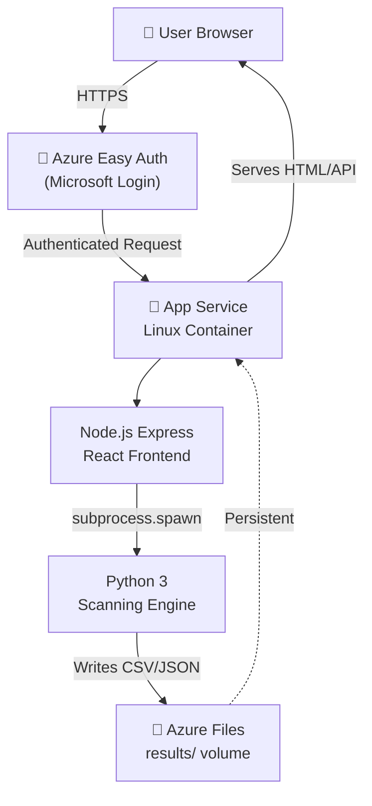

# Architecture Document — Scanner App

**Project:** ACA IT Solutions Scanner App  
**Date:** March 17, 2026  
**Status:** Deployment Ready  
**Author:** Thomas van Gompel

---

## Executive Summary

This document describes the cloud architecture for deploying the **Scanner App** — a security scanning application built with React (frontend), Express.js (backend), and Python (scanning engine) — to Microsoft Azure.

The deployment uses **containerization** to package all components (Node.js + Python) into a single deployable unit, simplifying infrastructure management and ensuring consistency between development and production environments.

---

## Architecture Overview

### High-Level Data Flow



---

## System Components

### 1. **Frontend (React + TypeScript)**
- **Location:** `scanner-app/client/`
- **Build:** Vite
- **Deployment:** Static files served by Express
- **Responsibilities:**
  - User interface for scan configuration
  - Real-time result dashboard
  - File download capability

### 2. **Backend (Express.js + TypeScript)**
- **Location:** `scanner-app/server/`
- **Port:** 8080 (hardcoded for App Service)
- **Responsibilities:**
  - REST API endpoints (`/api/scans`, `/api/runs`, `/api/results`)
  - Python subprocess orchestration
  - Static file serving (React build)
  - CORS handling
  - Results file serving

### 3. **Python Scanning Engine**
- **Location:** Root directory
- **Key Modules:**
  - `discovery_pipeline/` — domain discovery + analysis
  - `domain/` — domain scanning
  - `dns/` — DNS resolution
  - `whoIs/` — WHOIS lookups
- **Invocation:** Subprocess via Node.js bridge (`scan_bridge.py`)
- **Dependencies:** Listed in `requirements.txt` (requests, dnspython, whois, etc.)

### 4. **Container**
- **Base Image:** `node:22-slim` + Python 3.x
- **Build Strategy:** Multi-stage (separate client/server builds for optimized layer caching)
- **Final Image Size:** ~500MB (Node.js + Python + dependencies)

---

## Azure Resources

### Required Resources

| Resource | Name | SKU | Purpose |
|---|---|---|---|
| **Container Registry** | `acascanner` | Basic | Store Docker images |
| **App Service Plan** | `scanner-app-plan` | B1 Linux | Compute/hosting |
| **App Service** | `acascanner-app` | Linux/Python 3.X | Run container |
| **Storage Account** | `acascannerfiles` | Standard LRS | File storage |
| **File Share** | `results` | 100GB | Persistent results volume |

### Optional Resources

| Resource | Purpose | Estimated Cost |
|---|---|---|
| **Key Vault** | Store API secrets securely | ~€0.50/month |
| **Application Insights** | Monitor performance / logging | ~€5/month |
| **Azure Container Registry Tasks** | Auto-build on git push | ~€0.20/month |

---

## Deployment Pipeline

### Step 1: Local Development
```bash
# Work locally with .venv (Python) + node_modules
npm run dev --workspace scanner-app
# Express: http://localhost:4000
# React: http://localhost:5173
```

### Step 2: Build Docker Image
```bash
# Multi-stage build
# - Stage 1: Build React app (client/)
# - Stage 2: Build Express TypeScript (server/)
# - Stage 3: Final image with both + Python runtime
docker build -t acascanner.azurecr.io/scanner-app:latest .
```

### Step 3: Push to Registry
```bash
az acr login --name acascanner
docker push acascanner.azurecr.io/scanner-app:latest
```

### Step 4: Deploy to App Service
- Triggered automatically via Deployment Center
- App Service pulls image from Container Registry
- Container restarts with new code

---

## Security Implementation

### Authentication Layer
**Azure Easy Auth (Easy Authentication)**
- Enforces Microsoft Entra ID (Azure AD) login
- All HTTP requests → redirect to login if unauthenticated
- Uses `@aca-it.com` corporate identity
- No credentials stored in app code
- Optional: Multi-factor authentication via Azure AD policies

### Data Isolation
- Results stored in **Azure Files** (SMB share) — encrypted at rest
- Container is **stateless** — no sensitive data in image layers
- Environment secrets in **App Service > Configuration > Application settings**
  - Never committed to git
  - Auto-injected at runtime

### Container Security
- Non-root user execution (optional hardening)
- Minimal base image (`node:22-slim`)
- No SSH/shell access to container (use App Service Console if needed)

---

## Persistence & Volumes

### Azure Files Mount
```
App Service Container
└── /app/results/
    ├── domain_results/
    ├── dns_scans/
    ├── whois_data/
    └── dashboard.html
```

**Behavior:**
- Mounted via SMB protocol
- Survives container restarts/updates
- Accessible from App Service Console
- Backed by Azure Storage Account (Standard LRS redundancy)

---

## Environment Configuration

### Runtime Variables (set in App Service)

```ini
# Required
PORT=8080
PYTHON_EXECUTABLE=python3

# Optional (API keys, etc. — set per deployment)
INTEL_X_API_KEY=***
WHOIS_API_KEY=***
```

### Build-Time Configuration (in container)

```dockerfile
ENV PYTHON_EXECUTABLE=python3
ENV PORT=8080
```

---

## Monitoring & Logging

### Built-in (Free)
- **Access Logs:** App Service > Logs > HTTP logs
- **Stdout/Stderr:** Streamed to App Service diagnostics
- **Container Restart:** Auto-monitored by health checks

### Recommended (Optional)
- **Application Insights:** Real-time request tracing, error tracking
- **Azure Monitor:** CPU/Memory graphs, alerts

### Custom Logging
Add to Express (`server/src/index.ts`):
```typescript
app.use((req, res, next) => {
  console.log(`[${new Date().toISOString()}] ${req.method} ${req.path}`);
  next();
});
```

---

## Cost Estimation (Monthly)

| Resource | Tier | Est. Cost |
|---|---|---|
| App Service Plan | B1 Linux | $10 |
| Container Registry | Basic | $3 |
| Storage Account | Standard LRS | $0.50 |
| **Subtotal** | | **~$13.50** |
| Application Insights | (optional) | +$5 |

> **Note:** If deployed under **ACA IT Solutions' Azure subscription**, costs are covered by corporate billing. Verify with your manager before proceeding.

---

## Deployment Checklist

- [ ] **Local Testing**
  - [ ] Docker image builds locally: `docker build -t test .`
  - [ ] Container runs locally: `docker run -p 8080:8080 test`
  - [ ] Frontend loads at `http://localhost:8080`
  - [ ] API endpoints respond (e.g., `GET /api/health`)

- [ ] **Azure Setup**
  - [ ] Container Registry created
  - [ ] Storage Account + File Share created
  - [ ] App Service Plan + App Service created
  - [ ] Az CLI authenticated: `az login`

- [ ] **Image & Deployment**
  - [ ] Image pushed to registry: `docker push ...`
  - [ ] App Service Deployment Center configured
  - [ ] App Service pulls image successfully

- [ ] **Configuration**
  - [ ] Environment variables set in App Service
  - [ ] Azure Files volume mounted to `/app/results`
  - [ ] Easy Auth (Microsoft) enabled

- [ ] **Testing**
  - [ ] Navigate to `https://acascanner-app.azurewebsites.net`
  - [ ] Login with `@aca-it.com` account works
  - [ ] Frontend loads
  - [ ] API endpoints accessible
  - [ ] Scan runs successfully
  - [ ] Results saved to Azure Files

---

## Disaster Recovery

### Container Failure
- **Auto-restart:** App Service automatically restarts failed containers
- **Zero downtime:** Previous version still running until new one is ready

### Data Loss Prevention
- **Azure Files:** Geo-redundant backup available (upgrade Storage to GRS)
- **Docker Image:** Versioned in Container Registry (`latest`, `v1.0`, etc.)

### Rollback Procedure
```bash
# If new deployment breaks:
1. App Service > Deployment Center > "Restart"
2. Or manually trigger old image version:
   az container create --image acascanner.azurecr.io/scanner-app:v1.0 ...
```

---

## Future Enhancements

1. **Database Integration** (replace file-based results)
   - Azure SQL Database or Cosmos DB
   - Structured query capability
   - Better multi-user support

2. **Scaling**
   - Container App Service horizontal scaling
   - Queue-based job processing (Azure Service Bus)
   - Separate scanning worker pool

3. **CI/CD Automation**
   - GitHub Actions → auto-build on main branch
   - Auto-deploy to staging → manual promotion to production

4. **Advanced Security**
   - Azure KeyVault for secret management
   - Virtual Network (vnet) isolation
   - DDoS protection

---

## Support & Documentation

- **Azure CLI:** `az appservice --help`
- **Docker Docs:** https://docs.docker.com/
- **Express.js:** https://expressjs.com/
- **React Vite:** https://vitejs.dev/

---

**Document Version:** 1.0  
**Last Updated:** March 17, 2026  
**Next Review:** After first deployment
